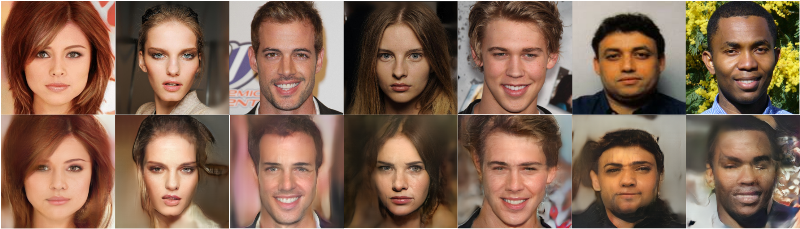

## Apprentissage Profond Génératif : Inversion


<br>
**Picture:** Résultats de l'inversion (Image de base à gauche et Inversion à droite)

## Description
**PGGAN :**<br>

PGGAN est un modèle génératif adversarial qui apprend à produire des images de haute qualité en augmentant progressivement leur résolution. L’entraînement débute sur des images de très basse résolution, ce qui permet au générateur et au discriminateur d’apprendre les structures globales de l’image. De nouvelles couches sont ensuite ajoutées au réseau pour affiner progressivement les détails à des résolutions plus élevées.  Au sein de chaque couche de convolution, une opération de type résiduelle est appliquée : l’image en entrée est réinjectée, après mise à l’échelle (upscaling ou downscaling), et combinée avec la sortie de la convolution dans la couche suivante. Cette stratégie rend l’apprentissage plus stable et améliore la qualité et le réalisme des images générées, en préservant certaines informations importantes tout au long de l’apprentissage et en facilitant la propagation des gradients.

**Inversion :**<br>

L’inversion d’un modèle génératif consiste à retrouver, à partir d’une image donnée, le vecteur latent qui a permis sa génération. Dans le cas de PGGAN, cette inversion repose sur l’optimisation itérative d’un vecteur latent afin de minimiser une fonction de coût mesurant l’écart entre l’image cible et l’image générée. Le générateur pré-entraîné est conservé fixe, tandis que le vecteur latent est ajusté par descente de gradient. Grâce à la structure progressive de PGGAN, l’optimisation peut être menée de manière stable, en exploitant les représentations multi-échelles du modèle pour capturer à la fois les structures globales et les détails fins de l’image.

## Requirements 

La version stable de python à utiliser est la 3.12 et les packages requis sont :

```
conda install torchvision numpy matplotlib pillow gradio
```
```
pip install opencv-python customtkinter
```

Pour lancer l'interface GUI on utilise la commande :
```
python -m gui.app
```

## Structure

| Fichier | Description |Fonctions |
|----|-------------|----------------------|
| `core/train.py` | Définit la classe Inversor pour l'inversion de l'image | Classe Inversor avec constructeur, random_start, step, set_alphas |
| `gui/app.py` | Définit l'application pour l'interface utilisateur | Classe App avec constructeur, build_ui, update_alpha1, update_alpha2, update_alpha3, main_loop, load_image, inv_action, qual_action, resume, stop_action |
| `gui/app_gradio.py` | Définit l'application web gradio pour l'interface utilisateur | Interfaceur web gradio, preprocess_image, init_inversor, random_start, run_optimization, set_alphas |
| `my_models/load_model.py` | Définit la classe FaceParsingManager pour créer un masque de l'image afin de mettre en avant certaines parties du visage | get_model, get_model_256, Classe FaceParsingManager avec constructeur, get_mask | 
| `my_models/model.py` | Reprend l'implémentation de BiSeNet | https://github.com/zllrunning/face-parsing.PyTorch |
| `my_models/resnet.py` | Reprend l'implémentation de BiSeNet | https://github.com/zllrunning/face-parsing.PyTorch |
| `utils/loss.py` | Définit la loss | multiscale_loss | 
| `utils/utils.py` | Définit des fonctions utilitaires | load_img_tensor, load_img, plot_img, load_img_tensor, normalize_01 | 
